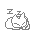
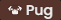

<h1> bakonpancakz</h1>

<b>Current Mission:</b> be awesome sauce

Things that I use on a regular basis, displayed in no particular order:

    
    
    
    
    
    
    
    
    
    
    
    
    
    
    
    
    
    
    
    
    

Projects that I consider cool enough to publish, check these out:

<table>
    <thead>
        <tr align="left">
            <th width="200px">Name</th>
            <th width="700px">Description</th>
            <th width="200px">Links</th>
        </tr>
    </thead>
    <tbody>
        <tr>
            <td>🔒 template-auth</td>
            <td>Feature-rich Authentication Framework written in Go</td>
            <td><a href="https://github.com/bakonpancakz/template-auth">Repository</a></td>
        </tr>
        <tr>
            <td>📧 emailengine</td>
            <td>Provide your applications a way to send emails with minimal headache</td>
            <td><a href="https://github.com/bakonpancakz/emailengine">Repository</a></td>
        </tr>
        <tr>
            <td>📦 s3-gatekeeper</td>
            <td>Use HMAC tokens and patterns to gatekeep S3 objects</td>
            <td><a href="https://github.com/bakonpancakz/s3-gatekeeper">Repository</a></td>
        </tr>
        <tr>
            <td>🎴 stickerboard</td>
            <td>Allow strangers to <i>'safely'</i> place Images on a canvas</td>
            <td>
                <a href="https://github.com/bakonpancakz/stickerboard">Repository</a>
                <a href="https://stickers.panca.kz/">Website</a>
            </td>
        </tr>
        <tr>
            <td>⌚ trackpad</td>
            <td>Show off your Wakatime and Lines of Code on Discord</td>
            <td><a href="https://github.com/bakonpancakz/trackpad">Repository</a></td>
        </tr>
        <tr>
            <td>
                    
                Cart Ride Around a Fumo
            </td>
            <td>A cute game I made on ROBLOX for fun, try it!!!</td>
            <td><a href="https://www.roblox.com/games/9987852646">Game</a></td>
        </tr>
    </tbody>
</table>

 

Find me here!

    
    
    
    

<h6 align="center">
    <i>Twitter and ROBLOX are personal spaces — beware!</i>
</h6>